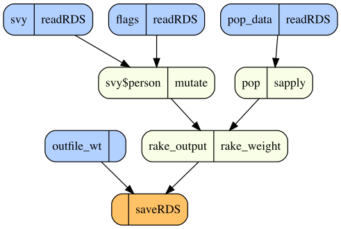

# dfgraph

Why visualize R code you ask? Well now, we data scientists don't exactly write beautiful production-quality code. Let's be honest, it's more likely to be bewildering spaghetti code. And if you're like me, dear reader, you've experienced the exquisite torture of deciphering an existing "workflow", perhaps one that you yourself created! Why not profit from my past suffering with a tool to help navigate this quagmire of confounding computerspeak?

### Disclaimer

This package is in an experimental, **pre-alpha state**. There are certain (probably fundamental) [limitations](#limitations) to parsing dependencies from an R script. Also, packages that visualize within-script dependencies have been built before (e.g, [CodeDepends](https://github.com/duncantl/CodeDepends)), and it's not clear that they've caught on. However, I have plans to implement an interactive, exploratory interface, which may make for a more compelling feature set.

## Installation

```r
install.packages("remotes")
remotes::install_github("dkary/dfgraph")
```

## Usage

Run `dfgraph::graph("path_to_R_or_Rmd_file")` (which leverages the [DiagrammeR](https://github.com/rich-iannone/DiagrammeR) package with a   [DOT](https://en.wikipedia.org/wiki/DOT_(graph_description_language)) format under the hood).

```r
dfgraph::graph(
    "testdat/svy-weight.R",
    # exclude diagnostic checks from the plot
    prune_labels = c("count", "summary", "sapply", "glimpse", "all.equal")
)
```


## Customize

### Prune Interim Nodes

Some nodes have only one dependency (referred to as "mutates"), and we can collapse these into their parent nodes with `prune_types = "mutate"`:

```r
dfgraph::graph(
    "testdat/svy-weight.R", prune_types = c("function", "mutate"),
    prune_labels = c("count", "summary", "sapply", "glimpse", "all.equal")
)
```


### Focus on one Node

Focus on the network of a specified node using `focus_node` (which you can reveal interactively by hovering over a node):

```r
dfgraph::graph(
    "testdat/svy-weight.R", prune_types = c("function", "mutate"), focus_node = 20, 
)
```


### Display more Info

We can also display both assignment and primary function for each node using `label_option = "both"`:

```r
dfgraph::graph(
    "testdat/svy-weight.R", prune_types = c("function", "mutate"), focus_node = 20, 
    label_option = "both"
)
```



## Limitations

The most obvious limitation is that code is inherently flexible, and I won't be able to capture all the ways people might program. For example:

- We can misidentify dependencies due to name scoping (e.g., dataframe$column "d" vs. global variable "d") with non-standard evaluation (e.g., in `dplyr`).

However, I suspect that I can capture enough of the common data science coding patterns for the package to nonetheless be useful (more details in [Proof of Concept](ref/POC.md)).

## Dry Feature List (Yawn)

- Parse and visualize a dependency graph for R expressions (as nodes) within an R or Rmd script (recursively parsing any `source` files included therein).

- Selectively prune (i.e., exclude) nodes from the visual while propagating their dependencies (including any global dependencies of assigned functions).

- Optionally focus only on the network of dependencies for a specified node.

- Display R code for an expression (node) on hover, optionally including all preceeding code which the selected expression depends upon.

- Handle loops and if/else blocks in a way that focuses on data flow instead of control flow. 
    + For example, treat a variable assignment that occurs in multiple conditions as a single node (like a Schrodinger's cat approach to data dependency).
