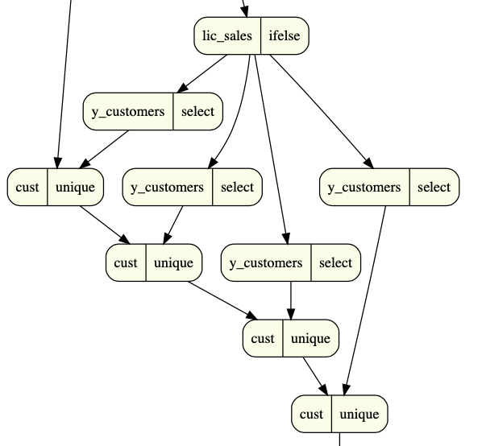
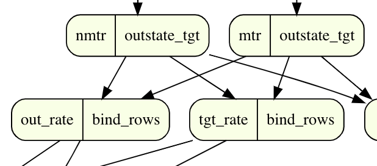

# Proof of Concept

Thoughts and observations about whether I think the basic functionality of this package will be useful. **Upshot:** I'm going with a tentative yes with a couple of caveats:

- I should test this on more in-the-wild code to see if there are any fatal flaws
- Interactivity will, I think, make this package more compelling and useful. It's worth diverting some effort currently to at least explore.

This is partly motivated by the "fail fast" approach. I tend to think that `dataflow` isn't really solvable in a general sense, but that it can still be useful if it works for the most common DS code patterns. 

## TODO

- [x] Test on SA code
- [ ] Test on other R project code in the wild on Github

### Plan

Test `plot_flow()` on a variety of in-the-wild R scripts. This will probably reveal bugs, so it may take some time (try not to get discouraged). I think it's okay to iterate and fix serious bugs, but my goal is to document (bugs found, features to prioritize, etc.). And, of course, assess whether `dataflow` appears feasible at all.

## Observations about Patterns

One of the reasons I'm feeling good about the POC is that I discovered some things about the POC scripts by examining the dataflow. If the patterns I observed have generalized utility, then the approach is probably worthwhile. People are good at visual pattern recognition, and even with a short timeframe I was able to map out some pattern categories. The first two were concepts I had already internalized, but the last three never really caught my attention until I examined a variety of dataflows:

- [Assemble](#assemble)
- [Expand](#expand)
- [Reconfigure](#reconfigure)
- [Interact](#interact) (an interdependence antipattern)
- [Pmap](#pmap) (multi input with multi output)

### Assemble

Multiple inputs with one output. This is a natural pattern in data processing and has some nice characteristics (easy to understand, modularize, etc.). The example below doesn't precisely follow that pattern since it has two outputs: a table of computed weights and a survey dataset with the weights applied. However, saving the weights table is a side-effect and the dataset itself is a direct input to the output survey table.

### Expand

The opposite of *assemble* (i.e., fewer inputs lead to more outputs). This is probably a natural pattern in reporting-type analysis, but I suspect it can indicate repetition (a probable antipattern) in other contexts.

### Reconfigure

A linked *expand-assemble*. I think it naturally arises when you have one (or few) highly enriched datasets. For example, a survey dataset contains high dimensionality in one table, and you often need to compute multiple interim inputs for an output of interest (e.g., participation rate).

### Interact

I originally called this *spaghetti* because of the confused criss-crossing of edges. On closer inspection a pattern of parallel pipelines occasionally intersecting appeared to be the cause (i.e., interdependence). I suspect there are a variety of cases where analysts will fall into this *anti-pattern*, and some of them are probably more problematic than others:

- **Checks**: Running checks (in analysis) to ensure an output conforms to expectations given values in other datasets.

- **Summary Columns**: Splitting a dataset into a relational model, and then adding summary columns (for ease of analysis) to higher-level dimensions. It can create interdependence when building higher and lower-level dimensions.

> Note that the `sitepairs.R` example from the `CodeDepends` package is another candidate for this interact pattern (and `timeseries.R` is a nice example of complexity).

### Pmap

Another cause of criss-crossing edges in when multiple inputs are used in multiple outputs. It looks awful, but it could be a simple matter of a functional approach (i.e., maybe one input varies to produce different outputs). It may still be a bit of an anti-pattern since the example I used suggests a split-apply-combine strategy would be appropriate (which would eliminate the criss-crossing).

This is a somewhat different case in which the `pop` dataset is repeatedly used in interim inputs. The criss-crossing goes away if you were to collapse the interim results, but it's a funny-looking pattern nonetheless.

## Interact Anti-Pattern

I think I've found a good candidate in my `nc > 2a-standardize-hunt-fish.R`. Some ideas:

- It seems partly a consequence of leaning so much on the sale table, which has an expansion pattern.

- However, the expansion pattern itself doesn't cause interdependence, rather the interaction with other patterns does:
    + tests on sale/lic incorporate outputs from parallel flows (cust), and these tests
occur at intermediate points (which causes the line intersection)
    + the workflow is organized logically by output table (sale, lic, cust) but interdependencies result in a spaghetti pattern
    + the database connection exacerbates this, so we can despaghetti somewhat by pruning connection definitions
    + some of the spaghetti is internal to the sale/lic path though: interim lic datasets rely on interim sale datasets

## High Repetition Anti-pattern

*Challenge*: Code that is highly repetitive (e.g., `NE Analysis and Sample Pull.Rmd`) is a common anti-pattern.

*Opportunity*: The visualization does make the repetition jump out, which may be useful in itself. An interactive node collapsing option would also provide a means to navigate this complexity. Are there existing tools that could be tapped into?

## Seemingly weird code patterns

The `NE Analysis and Sample Pull.Rmd` code looks bizarre to me (e.g., lines 43 to 50). I wonder how common these sorts of patterns are?
